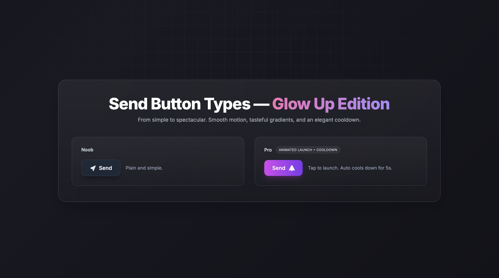

## Send Button Types — Glow Up Edition

### Preview


---

### ภาษาไทย (Thai)

เดโมหน้าเว็บโชว์ปุ่มส่ง 2 แบบ พร้อมดีไซน์ Glass UI + Gradient และแอนิเมชันลื่นไหล

- **Noob**: ปุ่มส่งแบบพื้นฐาน พร้อมแจ้งเตือนสไตล์ผู้เริ่มต้น
- **Pro**: ปุ่มส่งพร้อมจรวดและระบบคูลดาวน์ 5 วินาที + แจ้งเตือนสไตล์มืออาชีพ
- **Page load animation**: ตอนเปิดหน้า ทุกองค์ประกอบจะค่อยๆ ปรากฏแบบสุ่มเวลา 1.0–1.5 วินาที ด้วยเอฟเฟกต์เบลอแล้วคมชัด (unsynchronized)

หมายเหตุ: ห้ามเปลี่ยนระบบ/โครงสร้างของปุ่ม โดยเฉพาะ `#proBtn` และ `.rocket` เพราะโค้ด JS อ้างอิงโดยตรง

#### โครงสร้างโปรเจกต์

```
send-button/
├─ index.html
├─ styles.css
├─ script.js
├─ img/
│  └─ demo.png
└─ README.md
```

ใช้เทคโนโลยี:
- TailwindCSS (CDN)
- Vanilla JavaScript

#### วิธีรัน
- ดับเบิลคลิกเปิด `index.html` ในเบราว์เซอร์ได้ทันที
- หรือเปิดด้วย Live Server (VS Code)

#### ฟีเจอร์สำคัญ
- พื้นหลัง Gradient เคลื่อนไหว + เส้น Grid จางๆ
- Glass Panel + การจัดวาง 2 คอลัมน์ (Noob/Pro)
- ปุ่ม Pro ยิงจรวด พร้อมคูลดาวน์ 5 วินาที และแจ้งเตือนแบบ Pro
- แอนิเมชันโหลดหน้าแบบสุ่มช่วงเวลา 1000–1500ms ต่อองค์ประกอบ
- รองรับ `prefers-reduced-motion`

#### ระบบปุ่ม
- ปุ่ม Pro มี `id="proBtn"` และไอคอนอยู่ใน `<span class="rocket">…</span>` เมื่อกดจะเพิ่มคลาส `.shoot` และเข้าสู่คูลดาวน์ 5 วินาที
- ปุ่ม Noob เป็นปุ่มตัวอย่างสไตล์ธรรมดา พร้อม toast แจ้งเตือนแบบ Noob

#### ปรับแต่งได้
- สี/พื้นหลัง: ปรับใน `styles.css` (`body`, `.glass-panel`, `.section-card`)
- แอนิเมชันโหลดหน้า: ปรับ `durationMs`/`delayMs` ใน `script.js`
- ปิดแอนิเมชันโหลดหน้า: ใช้ `prefers-reduced-motion` หรือคอมเมนต์โค้ดส่วน Page-load ใน `script.js`

#### การเข้าถึง (A11y)
- เคารพ `prefers-reduced-motion`
- ปุ่มรองรับคีย์บอร์ดตามพฤติกรรมมาตรฐานของเบราว์เซอร์

#### แก้ปัญหาเบื้องต้น
- จรวดไม่ยิง: ตรวจว่า `#proBtn` และ `.rocket` อยู่ครบ และไม่มีคลาสแอนิเมชัน page-load ค้าง
- แอนิเมชันโหลดหน้าไม่ทำงาน: ตรวจคอนโซล และการตั้งค่า `prefers-reduced-motion`

#### เครดิต
- แนวคิดภาพ: สไตล์ Glass + Gradient + Grid
- ไอคอน: SVG inline ภายในไฟล์

---

### English

A small demo page showcasing two “Send” buttons with Glass UI + gradient visuals and smooth animations.

- **Noob**: A simple send button with a beginner-style toast
- **Pro**: A premium send button with a rocket launch animation and 5s cooldown + pro-style toast
- **Page load animation**: Elements appear with randomized 1.0–1.5s blur-in timings (unsynchronized)

#### Project structure

```
send-button/
├─ index.html
├─ styles.css
├─ script.js
├─ img/
│  └─ demo.png
└─ README.md
```

Tech stack:
- TailwindCSS (CDN)
- Vanilla JavaScript

#### How to run
- Double-click `index.html` to open in your browser
- Or use a Live Server (VS Code)

#### Key features
- Animated gradient background + subtle grid overlay
- Glass panel layout with two columns (Noob/Pro)
- Pro button rocket launch with 5s cooldown and pro-styled toast
- Randomized page-load fade-in 1000–1500ms per element
- Respects `prefers-reduced-motion`

#### Button system
- Pro button uses `id="proBtn"` with the icon wrapped in `<span class="rocket">…</span>`; on click, `.shoot` is applied and cooldown starts
- Noob button is a basic example with a beginner-styled toast

#### Customization
- Colors/backgrounds in `styles.css` (`body`, `.glass-panel`, `.section-card`)
- Page-load timing in `script.js` (`durationMs`/`delayMs`)
- Disable page-load animation via `prefers-reduced-motion` or by commenting the Page-load code in `script.js`

#### Accessibility
- Respects `prefers-reduced-motion`
- Buttons follow default browser keyboard behavior

#### Troubleshooting
- Rocket not launching: ensure `#proBtn` and `.rocket` exist and no leftover page-load classes remain
- Page-load animation missing: check console and your `prefers-reduced-motion` setting

#### Credits
- Visual direction: Glass + Gradient + Grid
- Icons: Inline SVGs in the file

